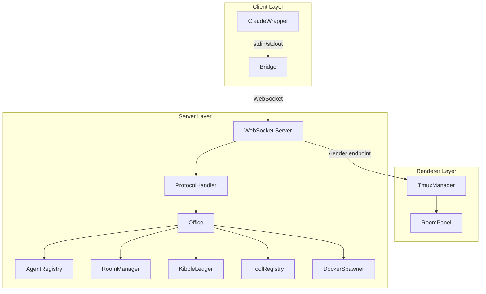
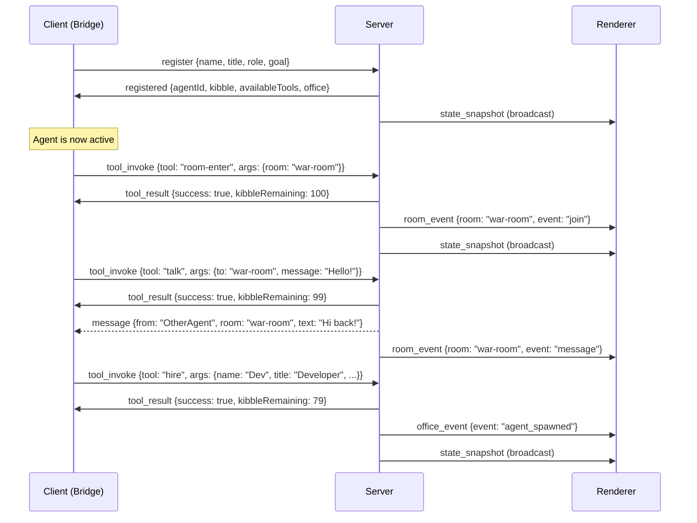
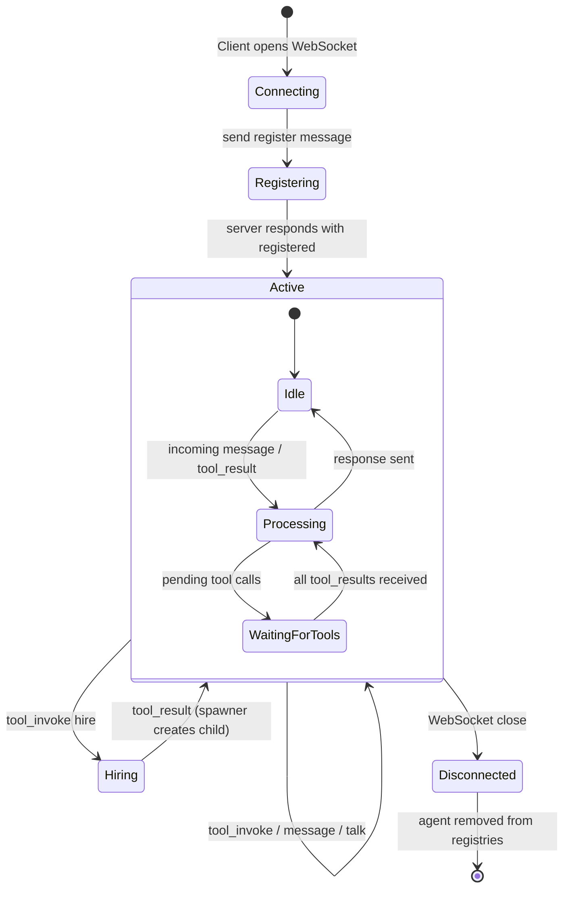
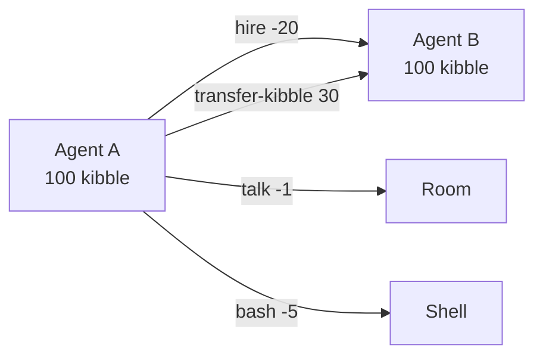
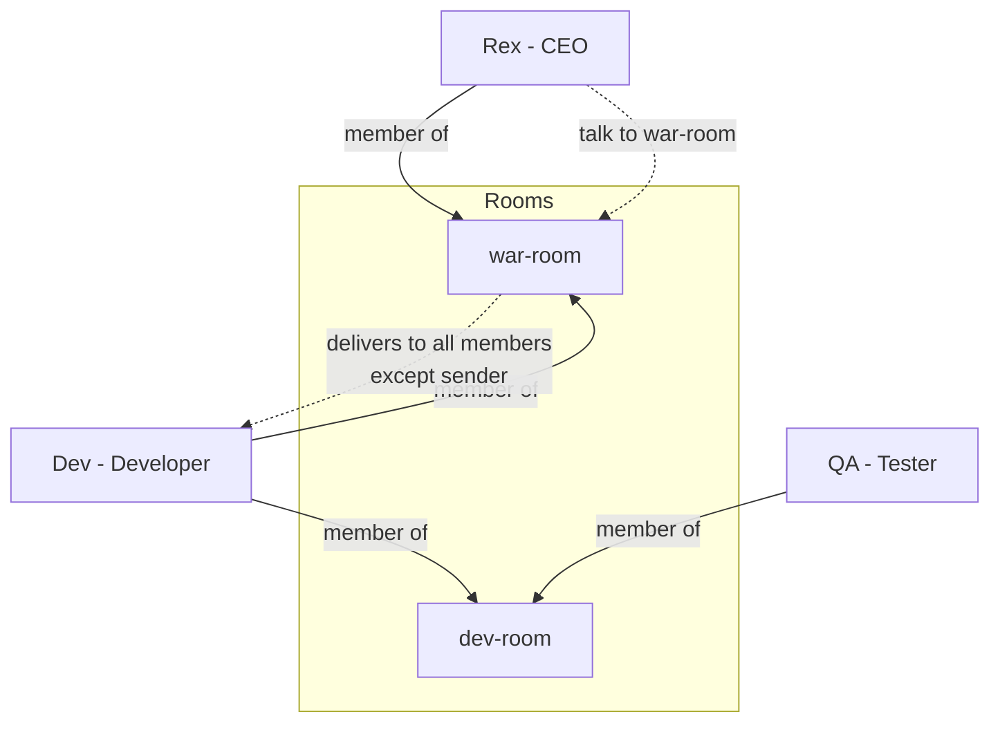
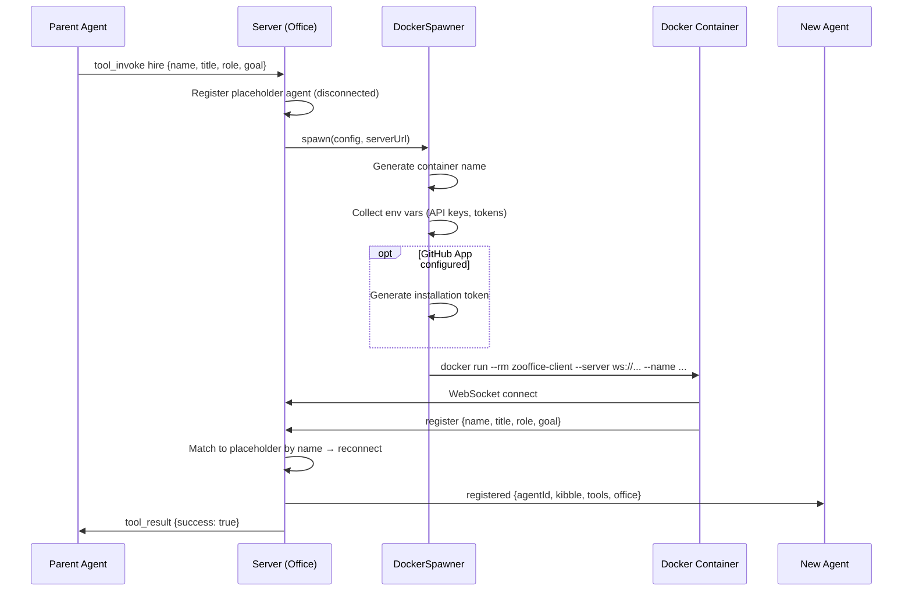

# Zooffice Architecture

Zooffice is an agent orchestration framework themed as an "office of animals." Autonomous AI agents connect to a central server, communicate through rooms, spend **kibble** to use tools, and can hire sub-agents — all coordinated over WebSocket.

---

## Three-Layer Architecture



| Layer | Purpose | Key Files |
|-------|---------|-----------|
| **Server** | Central orchestrator — manages agents, rooms, kibble, tools, and the WebSocket protocol | `src/server/office.ts`, `src/server/server.ts`, `src/server/protocol/handler.ts` |
| **Client** | Bridge between the server and a Claude CLI instance — translates WebSocket messages into prompts and tool calls back into protocol messages | `src/client/bridge.ts`, `src/client/claude-wrapper.ts` |
| **Renderer** | Tmux-based observer UI — subscribes to server broadcasts and displays one pane per room plus an office status pane | `src/renderer/tmux-manager.ts`, `src/renderer/room-panel.ts` |

---

## WebSocket Protocol Flow

Three message families flow over the wire, defined in `src/shared/protocol.ts`:

| Direction | Types | Purpose |
|-----------|-------|---------|
| Client → Server | `register`, `tool_invoke`, `talk` | Agent registration, tool execution requests, direct messages |
| Server → Client | `registered`, `message`, `tool_result`, `state_update`, `error` | Registration confirmation, incoming messages, tool results |
| Server → Renderer | `room_event`, `office_event`, `state_snapshot` | Broadcast events for the observer UI |



---

## Agent Lifecycle



### Registration Details

1. **Client connects** via WebSocket to the server.
2. **Client sends** a `register` message with `{name, title, role, goal}`.
3. **Server creates** an `Agent` in the `AgentRegistry`, credits initial kibble (100) via the `KibbleLedger`, and responds with a `registered` message containing the agent ID, kibble balance, available tools, and office overview.
4. **Bridge rebuilds** its system prompt with the tool definitions received from the server.

### Hiring Sub-Agents

1. Parent agent invokes the `hire` tool with `{name, title, role, goal}`.
2. Server registers a *disconnected* agent placeholder and auto-joins it into the parent's current room.
3. If **server-managed spawning** is enabled (Docker mode), the `DockerSpawner` launches a container. Otherwise, the client-side Bridge spawns a child `zooffice client connect` process.
4. The new agent connects and the server matches it to the pre-registered placeholder via name.

---

## Kibble Economy

Every agent starts with **100 kibble**. Each tool invocation costs a fixed amount, debited before execution.

| Tool | Cost | Description |
|------|------|-------------|
| `talk` | 1 kibble | Send a message to a room or agent |
| `room-enter` | 0 kibble | Enter a room (creates it if needed) |
| `room-leave` | 0 kibble | Leave a room |
| `bash` | 5 kibble | Run a shell command (30s timeout) |
| `hire` | 20 kibble | Hire a new agent |
| `transfer-kibble` | 0 kibble | Transfer kibble to another agent |



- **Debit**: The `KibbleLedger` checks the balance before each tool call. If insufficient, the tool call fails.
- **Credit**: New agents receive 100 kibble on registration. Agents can transfer kibble freely with `transfer-kibble`.
- **Ledger**: All transactions are recorded with timestamps and reasons for auditability.

---

## Room System & Message Routing



### How Rooms Work

- **Enter**: An agent calls `room-enter`. The server creates the room if it doesn't exist, adds the agent as a member, and broadcasts a `join` event.
- **Leave**: An agent calls `room-leave`. The server removes them and broadcasts a `leave` event.
- **Talk**: An agent calls `talk` with a room name. The message is delivered to all room members *except* the sender. A `room_event` broadcast is sent to renderers.
- **Direct Messages**: `talk` can also target an agent name directly (not a room). The message is delivered privately via the agent's WebSocket connection.
- **Auto-join on Hire**: When an agent hires a sub-agent, the new agent is automatically joined into the hiring agent's current room.

---

## Docker Spawner Flow

When the server runs with `--docker`, hired agents are spawned as Docker containers instead of local child processes.



### Environment Variables

The `DockerSpawner` forwards these environment variables into each container:

| Variable | Purpose |
|----------|---------|
| `ANTHROPIC_API_KEY` / `CLAUDE_API_KEY` | Claude CLI authentication |
| `GH_TOKEN` / `GITHUB_TOKEN` | GitHub CLI authentication |
| `ZOOFFICE_AGENT_NAME` | The agent's name (set per container) |

If a **GitHub App** is configured (`--github-app-id`, `--github-app-private-key`, `--github-app-installation-id`), a fresh installation token is generated per spawn and injected as `GH_TOKEN`.

---

## CLI Commands

```bash
# Start the server
zooffice server start --port 3000

# Start server with Docker spawning
zooffice server start --port 3000 --docker --docker-image ghcr.io/marcpilgaard/zooffice-client:latest

# Start server with integrated tmux renderer
zooffice server start --port 3000 --render

# Connect a client agent
zooffice client connect --server ws://localhost:3000 --name Rex --title CEO --goal "Manage the team"

# Start standalone tmux renderer
zooffice render --server ws://localhost:3000/render
```

---

## Project Structure

```
src/
├── cli.ts                      # Combined CLI entry point (server/client/render)
├── shared/
│   └── protocol.ts             # All WebSocket message type definitions
├── server/
│   ├── office.ts               # Top-level wiring (registers tools, manages connections)
│   ├── server.ts               # WebSocket server (ZoofficeServer)
│   ├── spawner.ts              # DockerSpawner for container-based agent launching
│   ├── github-app.ts           # GitHub App authentication for agent tokens
│   ├── logger.ts               # JSON-line logger
│   ├── agent/                  # Agent model and registry
│   ├── room/                   # Room model and manager
│   ├── kibble/                 # Kibble ledger (balance tracking)
│   ├── tools/                  # Built-in tool definitions
│   └── protocol/               # Protocol message handler
├── client/
│   ├── bridge.ts               # WebSocket ↔ Claude CLI bridge
│   └── claude-wrapper.ts       # Spawns `claude` CLI, parses tool calls
└── renderer/
    ├── tmux-manager.ts         # Tmux session/pane management
    └── room-panel.ts           # Event formatting for panes
```
